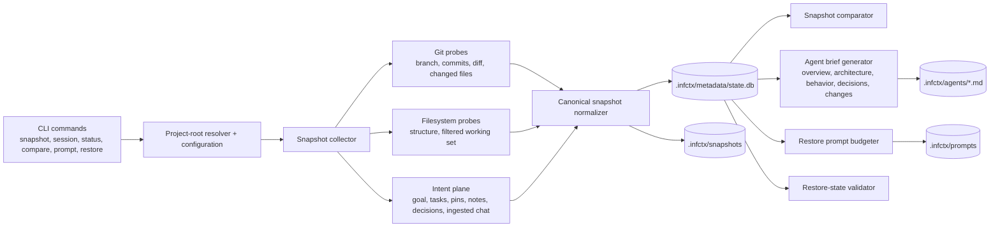
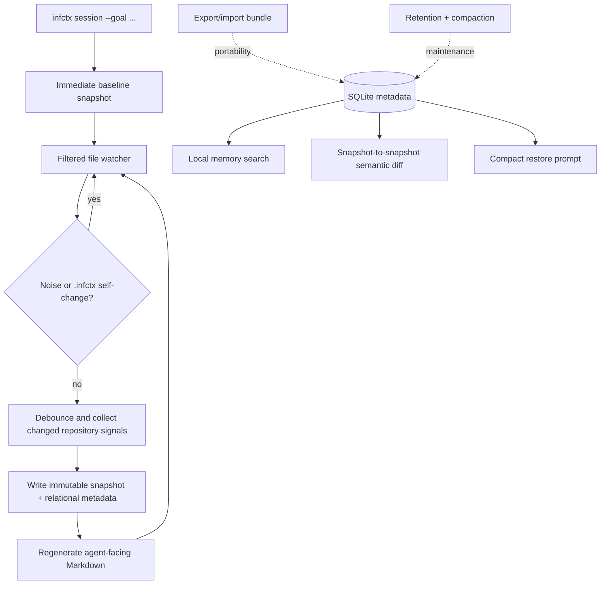
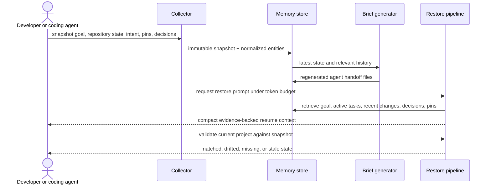

<p align="center">
  
</p>

<p align="center">
  <strong>Local-first project memory for AI coding workflows.</strong>
</p>

<p align="center">
  <a href="https://github.com/desenyon/infinitecontex/actions/workflows/ci.yml"></a>
  <a href="https://pypi.org/project/infinitecontex/"></a>
  <a href="https://github.com/desenyon/infinitecontex/releases"></a>
  
  <a href="LICENSE"></a>
</p>

<p align="center">
  <a href="#quick-start">Quick Start</a>
  <span> · </span>
  <a href="#why-it-exists">Why It Exists</a>
  <span> · </span>
  <a href="#commands">Commands</a>
  <span> · </span>
  <a href="#documentation">Docs</a>
</p>

---

<p align="center">
  
</p>

## What It Does

`infinitecontex` captures the working memory around a software project: repository structure, git state, diffs, runtime signals, decisions, active tasks, pinned files, and restore prompts. It stores that state locally in `.infctx/` so a developer or coding agent can recover context without rereading the whole repository from scratch.

Current version: `0.3.1`

| Local memory | Agent handoff | Snapshot diffing | Restore prompts |
| --- | --- | --- | --- |
| SQLite and project files under `.infctx/` | Regenerated Markdown briefs for coding agents | Compare goals, files, tasks, issues, and metrics | Compact prompts for resuming work |

```text
repo + git + chat + intent
        |
        v
  infctx snapshot
        |
        v
.infctx memory store
        |
        +--> agent handoff files
        +--> restore prompts
        +--> searchable history
        +--> snapshot diffs
```

## Why It Exists

Modern coding workflows lose context constantly: terminal output scrolls away, decisions live in chat, diffs only show the present moment, and agents often restart without the reasoning trail that got the project here. Infinite Context turns that working state into durable, inspectable memory.

| Need | Infinite Context gives you |
| --- | --- |
| Resume work after an interruption | Snapshot history and restore prompts |
| Hand off to another agent | Regenerated `.infctx/agents/*.md` files |
| Understand what changed | Snapshot-to-snapshot comparisons |
| Preserve decisions | `note`, `decisions`, and chat ingestion |
| Keep important files visible | `pin`, `pins`, and `unpin` |
| Stay local-first | SQLite and project files under `.infctx/` |

## Quick Start

Install the CLI:

```bash
uv tool install infinitecontex
infctx --version
```

Run from source during development:

```bash
uv sync --extra dev
uv run infctx --help
```

Initialize memory for a project:

```bash
uv run infctx init
uv run infctx snapshot --goal "stabilize the CLI release"
uv run infctx status
```

Work from outside the target repo:

```bash
uv run infctx --project-root /path/to/repo snapshot --goal "continue current work"
```

## Daily Workflow

### 1. Capture The Current State

```bash
uv run infctx snapshot --goal "ship the next release"
```

This records a structured view of the project and refreshes the agent-facing files in `.infctx/agents/`.

### 2. Review Memory

```bash
uv run infctx status
uv run infctx snapshots --limit 10
uv run infctx show-snapshot
```

Use these commands to inspect the latest goal, active tasks, pins, recent commits, and snapshot metadata.

### 3. Compare Work Over Time

```bash
uv run infctx compare-snapshots
```

By default, this compares the latest two snapshots and highlights changed files, task changes, issue changes, and metric deltas.

### 4. Generate A Handoff Prompt

```bash
uv run infctx prompt --mode generic-agent-restore --token-budget 1200
```

Use the generated prompt when you need a compact restore brief for another model, agent, or session.

### 5. Run A Live Session

```bash
uv run infctx session --goal "refactor restore flow"
```

`session` takes an immediate snapshot, watches filtered project changes, skips noisy `.infctx/` updates, and refreshes memory as work progresses.

## Commands

| Command | Purpose |
| --- | --- |
| `infctx init` | Create `.infctx/` and initialize local metadata |
| `infctx snapshot` | Capture a one-off project memory snapshot |
| `infctx session` | Start a live capture session |
| `infctx watch` | Compatibility alias for `session` |
| `infctx status` | Show latest memory state, pins, tasks, and commits |
| `infctx snapshots` | List recent snapshots |
| `infctx show-snapshot` | Inspect one snapshot in detail |
| `infctx compare-snapshots` | Compare two captured memory states |
| `infctx prompt` | Generate a compact restore prompt |
| `infctx restore` | Validate restore state against a snapshot |
| `infctx ingest-chat` | Ingest transcript-derived intent and decisions |
| `infctx note` | Save an architectural or workflow decision |
| `infctx decisions` | List recent decisions |
| `infctx pin` / `pins` / `unpin` | Manage high-priority context files |
| `infctx search` | Search local memory |
| `infctx diff-summary` | Summarize current uncommitted changes |
| `infctx config` | Read or apply project configuration |
| `infctx doctor` | Run integrity and dependency diagnostics |
| `infctx export` / `import` | Move local memory between machines |
| `infctx cleanup` | Prune old snapshots and compact storage |
| `infctx setup-agent` | Wire Cursor, Claude, Copilot, or Windsurf to `.infctx/agents/` |

Global options:

```bash
infctx --project-root /path/to/repo status
infctx --version
infctx --help
```

## Generated State

Infinite Context keeps generated files inside `.infctx/`:

```text
.infctx/
  agents/
    architecture.md
    behavioral.md
    decisions.md
    instructions.md
    overview.md
    recent_changes.md
  metadata/
    state.db
  prompts/
  snapshots/
  working_set/
```

The most useful files for agents are in `.infctx/agents/`. They are regenerated from snapshots and are safe to read before making changes.

## Configuration

Apply the included Python-oriented preset:

```bash
uv run infctx config --set-file config/default.json
```

The global root option works before the command:

```bash
uv run infctx --project-root /path/to/repo config --set-file config/default.json
```

## Development

```bash
uv sync --extra dev
uv run ruff check .
uv run mypy src
uv run pytest
uv build
```

Current local QC:

- `78` tests passing
- `95%` total coverage
- `100%` coverage for `src/infinitecontex/cli.py`
- `uv build` produces the wheel and source archive

## Documentation

| Topic | File |
| --- | --- |
| Product overview | [docs/overview.md](docs/overview.md) |
| Architecture | [docs/architecture.md](docs/architecture.md) |
| CLI reference | [docs/cli-reference.md](docs/cli-reference.md) |
| CLI behavior contract | [docs/cli-behavior-contract.md](docs/cli-behavior-contract.md) |
| Configuration | [docs/config-reference.md](docs/config-reference.md) |
| Data model | [docs/data-model-reference.md](docs/data-model-reference.md) |
| Restore pipeline | [docs/restore-pipeline.md](docs/restore-pipeline.md) |
| Security and privacy | [docs/security-privacy.md](docs/security-privacy.md) |
| Testing strategy | [docs/testing-strategy.md](docs/testing-strategy.md) |
| Troubleshooting | [docs/troubleshooting.md](docs/troubleshooting.md) |

## Release Notes

See [CHANGELOG.md](CHANGELOG.md) for release history. The `0.3.1` release adds the global `--project-root` option, removes stale external packaging, simplifies CI, and expands CLI coverage.

## License

MIT. See [LICENSE](LICENSE).

<!-- architecture-atlas-v5:start -->
## Architecture Atlas v5

These editable Mermaid diagrams mirror the [Notion architecture dossier](https://app.notion.com/p/3b467342e8c1814eadb4df76f13362cd?pvs=204).

### 1. Memory anatomy



### 2. Live-session wiring



### 3. Resume narrative



### 4. Reliability model

```mermaid
stateDiagram-v2
  [*] --> UNINITIALIZED
  UNINITIALIZED --> INITIALIZED
  INITIALIZED --> SNAPSHOTTING --> SNAPSHOT_COMMITTED --> BRIEFS_REFRESHED
  BRIEFS_REFRESHED --> WATCHING
  WATCHING --> SNAPSHOTTING: meaningful project change
  SNAPSHOT_COMMITTED --> COMPARING
  SNAPSHOT_COMMITTED --> PROMPTING
  SNAPSHOT_COMMITTED --> RESTORE_VALIDATION
  RESTORE_VALIDATION --> MATCHED
  RESTORE_VALIDATION --> DRIFT_DETECTED
  DRIFT_DETECTED --> SNAPSHOTTING
```

<!-- architecture-atlas-v5:end -->
