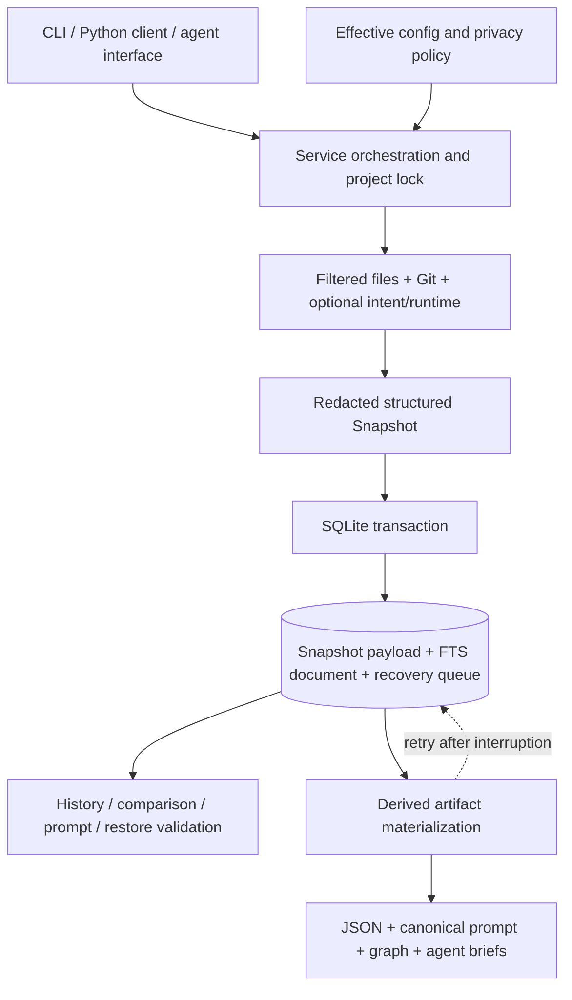

<p align="center">
  
</p>

# Infinite Context

Local project memory for developers and coding agents. `infinitecontex` captures repository structure, Git work state, explicit goals and decisions, and optional chat and terminal signals. It keeps inspectable history in `.infctx/` and generates Markdown briefs for the next session.

This branch targets **0.4.0**. The changes described here are development changes, not a claim that a release has been published. Python **3.11+** and Git are required for the complete workflow. Capture, retrieval, prompt generation, and the test suite run locally without API keys, model downloads, or paid services.

[Quick start](#quick-start) · [Commands](#commands) · [Privacy](#privacy-and-capture-boundaries) · [Recovery](#storage-and-recovery) · [Development](#development-and-validation)

## What you get

| Need | Workflow |
| --- | --- |
| Resume a project | Capture a snapshot, inspect history, generate a restore prompt |
| Hand off work | Read the generated `.infctx/agents/` briefs |
| Understand drift | Compare snapshots; validate recorded fingerprints against current files |
| Remember reasoning | Record decisions and pins; optionally persist extracted chat intent |
| Maintain history | Search snapshots, retain recent records, rebuild derived files |
| Move memory | Export a consistent archive and import it into another project |

A snapshot is a structured summary and file fingerprint set. It is **not a source-code backup**. `restore` reports divergence; it does not modify source files, reset Git, or replay shell commands.

## Quick start

Install the published package using either tool:

```bash
uv tool install infinitecontex
# Or: pip install infinitecontex
infctx --version
```

To try this branch's changes, clone it and run from source:

```bash
git clone https://github.com/desenyon/infinitecontex.git
cd infinitecontex
git switch codex/reliable-context-storage
uv sync --locked --extra dev --python 3.13
uv run infctx --help
```

Initialize a project, then capture and inspect its state:

```bash
infctx --project-root /path/to/project init
infctx --project-root /path/to/project snapshot --goal "finish the storage migration"
infctx --project-root /path/to/project status
infctx --project-root /path/to/project prompt --mode generic-agent-restore --token-budget 1200
```

When working from the source checkout, use `uv run infctx` in place of `infctx`. The root defaults to the current directory; `--project-root` also works after the command.

Add these entries to the **target project's** `.gitignore` to keep local memory and locks out of commits:

```gitignore
.infctx/
.infctx.lock
.infctx-import-*/
```

The CLI does not modify the project's ignore file automatically.

## Daily workflow

Capture an explicit goal and decision, then pin useful context:

```bash
infctx snapshot --goal "make imports recoverable"
infctx note --summary "SQLite owns committed snapshots" --rationale "Derived files can be rebuilt"
infctx pin --path src/storage.py --note "storage boundary"
infctx pins
```

History, comparison, and validation:

```bash
infctx snapshots --limit 10 --json
infctx show-snapshot --json
infctx compare-snapshots --json
infctx restore --json
infctx search --query 'SQLite'
```

`compare-snapshots` defaults to the latest two records. Use `--from-snapshot ID --to-snapshot ID` to select records. `show-snapshot`, `restore`, and `prompt` accept `--snapshot-id ID`. File comparisons use SHA-1 fingerprints to detect content changes; these are change identifiers, not cryptographic authenticity proofs.

Start a live session:

```bash
infctx session --goal "finish the refactor"
# Capture once with a machine-readable result:
infctx session --goal "finish the refactor" --once --json
```

A session captures immediately, watches changes, applies exclusions, and refreshes snapshots subject to `--debounce-ms` and `--min-interval-sec`. `watch` remains a compatibility alias. Long-running sessions do not support `--json`; use `--once --json` for automation.

Wire an editor or agent:

```bash
infctx setup-agent claude
# Also supported: cursor, copilot, windsurf
```

This manages a marked block in `CLAUDE.md`, `.cursorrules`, `.github/copilot-instructions.md`, or `.windsurfrules`. Existing instructions outside the block are preserved, and running it again updates the same block. Linked destinations and malformed duplicate markers are rejected. Generated context should be checked against the current repository and user instructions.

## Commands

| Command | Purpose / useful options |
| --- | --- |
| `init` | Initialize or migrate local state |
| `snapshot` | Capture a snapshot; `--goal`, `--json` |
| `session` / `watch` | Capture continuously; `session --once --json` for one capture |
| `status` | Goal, branch, pins, counts, and recent commits; `--json` |
| `snapshots` | History; `--limit`, `--json` |
| `show-snapshot` | Full record; `--snapshot-id`, `--json` |
| `compare-snapshots` | Files, tasks, issues, and metric changes; `--from-snapshot`, `--to-snapshot`, `--json` |
| `prompt` | Render a brief; `--mode`, `--token-budget`, `--snapshot-id` |
| `restore` | Validate current files against a snapshot; `--snapshot-id`, `--json` |
| `ingest-chat` | Extract chat intent; `--file PATH` or `--auto`, `--json` |
| `note` / `decisions` | Store and list explicit decisions |
| `pin` / `pins` / `unpin` | Manage paths as context pointers |
| `search` | SQLite FTS5 search; `--query`, `--limit`, `--json` |
| `diff-summary` | Staged, unstaged, renamed, and untracked Git paths |
| `config` | Effective settings, or apply `--set-file PATH` |
| `doctor` | Inspect database, schema, pending recovery, and artifacts; `--json` |
| `repair` | Rebuild snapshot JSON, canonical prompts, search, graph, and handoff; `--json` |
| `cleanup` | Retain `--keep N` snapshots; deletion requires `--yes` |
| `export` / `import` | `--output PATH` / `--archive PATH` |
| `setup-agent` | Manage the integration block for a supported agent |

Use `infctx COMMAND --help` for the complete flag set. Existing CLI names, Python entry points, prompt modes, snapshot fields, and standard file locations are retained. The ingest result adds a `persisted` boolean.

## Privacy and capture boundaries

Both optional persistence flags default to `false` and are now enforced:

| Setting | Disabled | Enabled |
| --- | --- | --- |
| `policies.privacy.persist_chat_ingest` | Return a redacted preview; do not save intent, transcript search content, or source-path events; ignore saved chat intent in new snapshots | Save redacted extracted intent and index redacted source text |
| `policies.privacy.persist_shell_history` | Do not read terminal logs into snapshots | Summarize `.infctx/working_set/terminal.log` and redact the results |

Explicit `--goal`, `note`, and `pin` operations still persist their requested content. There is no automatic shell-history collector. The terminal input is a file the user supplies. Chat auto-discovery happens only when `ingest-chat --auto` is requested; it can inspect local editor/agent data, so use `--file` when you need a precise source.

Enable optional capture with a configuration file:

```json
{
  "policies": {
    "privacy": {
      "persist_chat_ingest": true,
      "persist_shell_history": true,
      "redact_patterns": [
        "(?i)api[_-]?key\\s*[:=]\\s*\\S+",
        "(?i)token\\s*[:=]\\s*\\S+",
        "(?i)password\\s*[:=]\\s*\\S+"
      ]
    }
  }
}
```

```bash
infctx config --set-file capture-config.json
infctx ingest-chat --file /path/to/transcript.txt --json
infctx snapshot
```

Redaction runs before storing ingested chat, explicit decisions and pin notes, and the textual snapshot context used to produce prompts, search, and handoff files. Invalid regular expressions are rejected when configuration is validated. Re-ingesting the same source replaces its search document instead of adding duplicates.

**Redaction is best effort, not secret detection or encryption.** It does not rewrite your source files or original terminal/transcript inputs. File names, fingerprints, absolute project paths, and historical records can remain sensitive. Disabling persistence affects future capture; it does not erase previous snapshots, chat index entries, events, manually supplied logs, or existing archives. Exports contain historical state and input files under `.infctx/`; inspect them before sharing. `cleanup` removes snapshot history and its derived artifacts, not chat or decision history, and is not secure erasure.

Repository scanning uses sorted traversal with configurable include/exclude patterns. It always excludes internal `.git` / `.infctx` state, skips symlinks, hard-linked files, special files, unreadable files, and files larger than 2 MiB. Directory descriptions come only from files admitted by the same filters. Restore validation uses the same containment checks, including for paths from imported snapshots. Put transcripts or secrets outside the project or exclude them explicitly: the chat flag does not override a repository include pattern that selects a transcript file.

## Configuration

Effective settings merge in this order, highest priority first:

1. `INFCTX_TOKEN_BUDGET` (the currently supported environment override).
2. `.infctx/config.json` in the target project.
3. `~/.config/infinitecontex/config.json`.
4. Built-in defaults.

```bash
infctx config --json
infctx config --set-file config/default.json
INFCTX_TOKEN_BUDGET=1800 infctx snapshot --goal "review the API"
```

`config --set-file` validates the supplied object as an `AppConfig` and writes a complete repo configuration with defaults for omitted values. Edit `.infctx/config.json` directly when you want a sparse overlay. A relative `--set-file` path is resolved against the selected project when possible.

| Field | Default / behavior |
| --- | --- |
| `capture_max_files` | `1500`; positive limit on admitted files |
| `include_patterns` | Python, Markdown, and `pyproject.toml`; `[]` captures no files |
| `exclude_patterns` | Git/state, common environments, caches, builds, and bundled skills |
| `policies.token.default_budget` | `1200`; used for snapshot prompts |
| `policies.privacy.*` | Persistence flags and ordered regular-expression redaction patterns |
| `project_name`, `modes` | Accepted configuration metadata; do not rename the project or restrict CLI mode choices |
| `policies.token.min_budget`, `max_budget` | Retained settings; currently not enforced by the prompt compiler |
| `policies.summarization.*` | Retained settings; capture/compiler still use their built-in section limits |

The included `config/default.json` is a Python-focused preset with a 600-file limit. Other languages can be included as file metadata and text insights; call hints and symbol extraction are Python AST heuristics. Patterns are shell-style matches against relative paths, with support for leading `**/` and trailing `/**`; they are not `.gitignore` rules. The scanner does not automatically apply `.gitignore`.

## Architecture


```mermaid
flowchart TD
    CLI[CLI / Python client / agent interface] --> Service[Service orchestration and project lock]
    Config[Effective config and privacy policy] --> Service
    Service --> Capture[Filtered files + Git + optional intent/runtime]
    Capture --> Redact[Redacted structured Snapshot]
    Redact --> Commit[SQLite transaction]
    Commit --> DB[(Snapshot payload + FTS document + recovery queue)]
    DB --> Reads[History / comparison / prompt / restore validation]
    DB --> Repair[Derived artifact materialization]
    Repair --> Files[JSON + canonical prompt + graph + agent briefs]
    Repair -. retry after interruption .-> DB
```

The service coordinates capture and policy. `storage/snapshots.py` owns snapshot persistence, migration, retention, and recovery. SQLite commits the snapshot payload, its search document, and durable artifact work together. Only then does materialization replace generated files. CLI, Python client, and agent tools share this repository through the service.

If an artifact write fails, the committed snapshot remains readable and searchable. A warning identifies the need for repair; pending work survives process exit. The next mutating operation retries pending work, or `repair` explicitly rebuilds it. Shared graph and handoff files represent the latest committed snapshot. The handoff files are replaced individually, so an external reader can see a mixture while they are being refreshed; use the snapshot API for a consistent record.

Cooperating service operations use a reentrant process lock at `.infctx.lock`, outside the archive tree. SQLite also protects transactions. Direct file edits, external database writers, and older clients do not participate in this lock. Snapshot capture describes a changing worktree; it does not freeze the filesystem or Git index.

## Storage and recovery

```text
project/
  .infctx.lock                 # advisory lock; do not delete while a process is running
  .infctx/
    config.json               # optional repo configuration
    metadata/
      manifest.json           # storage schema version 2
      state.db                # authoritative snapshots, decisions, pins, FTS, recovery queue
    snapshots/ID.json         # compatible, rebuildable snapshot copies
    prompts/ID.prompt.md       # canonical generic restore prompt
    agents/*.md               # overview, architecture, decisions, behavior, changes, instructions
    project/inside.infinite_context.{json,md} # legacy handoff paths
    graph/context_graph.json  # latest snapshot's file and call graph
    summaries/restore-ID.json # divergence reports
    working_set/              # optional intent_state.json and user-supplied terminal.log
    events/events.jsonl       # local operational events
    exports/                  # user-created portable archives
    retrieval/, decisions/   # reserved compatibility directories
```

Check and repair:

```bash
infctx doctor --json
infctx repair --json
infctx cleanup --keep 20             # previews the required confirmation when deletion is needed
infctx cleanup --keep 20 --yes
```

`doctor` does not initialize an absent database or run migrations. It checks SQLite integrity, snapshot payload validity, missing/divergent snapshot copies, missing canonical prompts, pending recovery, and orphan snapshot search rows. It is diagnostic, not a full content audit of every generated file.

`repair` rebuilds from committed database records. It repairs search entries, discards orphan generated snapshot copies, and regenerates the latest graph/handoff. Custom prompt variants and restore reports are generated on demand. Retention deletes database rows and snapshot search entries together, then removes JSON, all known prompt variants, and restore reports. `--keep 0` also clears the latest graph and handoff. Negative retention counts are rejected.

### Upgrade from 0.3.x

Back up `.infctx/` while clients are stopped, upgrade the package, and run:

```bash
infctx repair --json
infctx doctor --json
```

The additive version-2 migration keeps existing tables, IDs, snapshot JSON models, decisions, pins, and paths. Existing database records take precedence over JSON copies. Valid JSON-only legacy snapshots are adopted once when migrating an old or missing database; malformed legacy files stop migration without removing them. Stale snapshot search rows are rebuilt. After migration, editing a JSON copy does not change the committed record.

Privacy defaults are an intentional bug fix: older versions persisted optional inputs despite flags being `false`. Set the flags to `true` explicitly if you want future captures to continue that behavior. Old sensitive state is not automatically deleted. Archive validation now rejects previously accepted unsafe bundles. `setup-agent` preserves existing files using a managed block.

Do not alternate old and new writers on the same state directory. To recover from loss of the entire database, stop writers and work on a backup of the state tree: initialization can adopt surviving snapshot JSON, but decisions, pins, chat search, and other database-only information require a database backup. `repair` cannot reconstruct a corrupt authoritative database from incomplete derived files automatically.

## Export and import

```bash
infctx export --output /safe/path/context.tgz
infctx --project-root /path/to/other-project import --archive /safe/path/context.tgz
infctx --project-root /path/to/other-project doctor --json
```

Exports use SQLite's backup API so committed WAL data is included. They exclude the contents of `.infctx/exports/`, avoiding nested and self-including archives. The output is published only after the archive is complete; output inside `.infctx/` must be under `exports/`.

Imports accept only normalized files/directories beneath `.infctx/`. They reject absolute/traversal paths, links, special files, duplicate names (including case aliases), path collisions, and oversized bundles. Limits are 20,000 entries, 256 MiB per entry, and 1 GiB total declared uncompressed data. Validation and extraction happen in a staging directory before live state is replaced. SQLite integrity, configuration, and snapshot records are validated there.

Import retains the previous merge behavior for ordinary files: archive files overlay existing state. If the archive contains `metadata/state.db`, that database replaces the destination's metadata/history; histories are **not merged**. Repair then reconciles generated snapshot artifacts with that database. Export the destination first if it contains memory you need to retain.

Publication uses same-filesystem renames with rollback on failure. If interrupted between renames, the next locked operation restores `.infctx-import-backup`. Temporary staging directories may remain after a killed process; inspect/remove them only with writers stopped. Archives are not encrypted or authenticated. Import only state you trust as context; safe paths do not establish the truth of its contents.

## Python API

```python
from infinitecontex.api.client import InfiniteContextClient
from infinitecontex.core.config import AppConfig
from infinitecontex.core.models import PromptMode

client = InfiniteContextClient("/path/to/project")
client.init()
snapshot = client.snapshot(goal="finish the migration")
print(client.show_snapshot(snapshot.id))
print(client.prompt(PromptMode.HUMAN_HANDOFF, token_budget=1200))
print(client.restore(snapshot.id))
print(client.doctor())
client.repair()
client.cleanup(keep=20)

config = AppConfig()
config.policies.privacy.persist_chat_ingest = True
client.set_config(config)
```

`InfiniteContextService` supplies the same operations directly. `AgentToolInterface` wraps snapshot, restore, prompt, and search for embedding; this project does not launch an MCP server or hosted service.

## Development and validation

```bash
uv sync --locked --extra dev --python 3.13
uv run ruff check .
uv run mypy src
uv run pytest
uv run python scripts/smoke.py
uv build
```

Tests include capture/restore flows, CLI and client compatibility, archive attacks and rollback, SQLite transaction failure, artifact recovery, concurrent writer processes, privacy opt-in/out, retention, FTS replacement, and migration from legacy JSON. The smoke script creates a disposable Git repository and exercises real CLI subprocesses through export/import and recovery. It uses synthetic data and does not call external services.

CI runs lint, strict typing, tests, the smoke script, and package builds on Python 3.11 and 3.13. The scan timing test is a small regression guardrail, not a benchmark claim. Dependency installation may need network access; execution of the installed application and test scenarios does not.

## Limitations

- Local filesystem storage with advisory locks; hostile concurrent filesystem mutation and distributed/network-filesystem writers are outside the consistency guarantee.
- Tested development platforms are macOS and Linux. The Windows locking path exists but needs Windows validation.
- Artifact replacement is atomic per file, not across the full tree; process-crash recovery is supported, but this is not a power-loss-proof backup system.
- Python-oriented heuristics; no semantic model, embeddings, remote inference, or whole-program call graph.
- Token budgeting estimates characters per token and includes fixed prompt framing; it is not an exact tokenizer-enforced cap.
- Search accepts SQLite FTS5 query syntax. Invalid expressions produce an error; only snapshot prompts and opted-in chat source text are indexed, not every source file or standalone note.
- Capture skips files it cannot safely read, without a per-file omission report. A filtered or capped scan is not a complete inventory.
- Some legacy configuration fields are retained but inactive, as listed above. Changing capture settings does not rewrite old snapshots.

## More documentation

[Architecture](docs/architecture.md) · [Storage and migration](docs/storage-format.md) · [CLI reference](docs/cli-reference.md) · [Configuration](docs/config-reference.md) · [Security/privacy](docs/security-privacy.md) · [Testing](docs/testing-strategy.md) · [Troubleshooting](docs/troubleshooting.md) · [Changelog](CHANGELOG.md)

MIT licensed. See [LICENSE](LICENSE).
